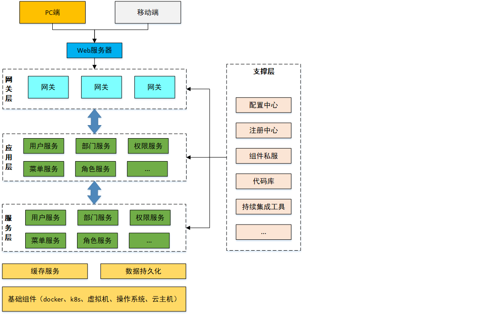

# 品达通用权限系统

## 项目介绍

对于企业中的项目绝大多数都需要进行用户权限管理, 认证, 鉴权, 加密, 解密, XSS防跨站攻击等.

这些功能整体实现思路基本一致, 但是大部分项目都需要实现一次, 这无形中就形成了巨大的资源浪费.

PD通用权限系统基于SpringCloud(Hoxton.SR1) + SpringBoot(2.2.2.RELEASE) 的微服务框架, 具备通用的用户管理, 资源权限管理, 网关统一鉴权, XSS防跨站攻击等多个模块, 支持多业务系统并行开发, 支持多服务并行开发, 可以作为后端服务的开发脚手架.

核心技术采用SpringBoot, Zuul, Nacos, Fegin, Ribbon, Hystrix, JWT Token, Mybatis Plus等主要框架和中间件.

本项目具有两个主要功能特性:

用户权限管理: 具有用户, 部门, 岗位, 角色, 菜单管理, 并通过网关进行统一的权限认证.

微服务开发框架: 本项目同时也是一个微服务开发框架, 集成了基础的公共组件, 包括数据库, 缓存, 日志, 表单验证, 对象转换, 防注入和接口文档管理等工具.

## 环境要求

- JDK  1.8 +
- Maven 3.3 +
  - http://maven.apache.org/download.cgi
- Docker 18 +
- docker-compose 1.23  +
- Mysql 5.7.0 +
  - https://downloads.mysql.com/archives/community
- Redis 4.0 +
  - https://redis.io/downloa
- Nacos 1.1.4
  - https://github.com/alibaba/nacos/releases
- Node  11.3+
  - https://nodejs.org/en/download

## 业务架构



## 功能架构


## 权限数据模型介绍

在项目中要进行权限控制, 需要有一套权限相关的数据表来提供支持, 这是整个权限控制的基础. 本系统采用的权限数据模型是在经典的RBAC权限数据模型的基础之上进行的改进, 共涉及到如下9张表.

```shell
pd_core_org----------------组织表
pd_core_station------------岗位表
pd_auth_user---------------用户表
pd_auth_role---------------角色表
pd_auth_resource-----------资源表
pd_auth_menu---------------菜单表
pd_auth_user_role----------用户角色关系表
pd_auth_role_authority-----角色权限关系表
pd_auth_role_org-----------角色组织关系表
```

需要说明的是菜单和资源其实都属于权限, 是两种不同类型的权限, 即菜单权限和资源权限.

菜单权限: 对应的是系统的菜单, 不同的用户可能拥有不同的菜单权限, 这样登录系统后看到的菜单也不同

资源权限: 对应的是某个功能的访问接口, 拥有权限则可以访问此接口, 没有权限则禁止访问此接口

## 模块说明

```shell script
pinda-authority              # 聚合工程, 用于聚合pd-parent, pd-apps, pd-tools等模块
├── pd-parent				 				 # 父工程, nacos配置及依赖包管理
├── pd-apps					 				 # 应用目录
	├── pd-auth				 				 # 权限服务父工程
		├── pd-auth-entity   		 # 权限实体
		├── pa-auth-server       # 权限服务
	├── pd-gateway			       # 网关服务
├── pd-authority-ui					 # 前端工程
└── pd-tools				         # 工具工程
	├── pd-tools-common		     # 基础组件: 基础配置类, 函数, 常量, 统一异常处理, undertow服务器
	├── pd-tools-core		       # 核心组件: 基础实体, 返回对象, 上下文, 异常处理, 分布式锁, 函数, 树
	├── pd-tools-database	     # 数据源组件: 数据源配置, 数据权限, 查询条件等
	├── pd-tools-dozer		     # 对象转换: dozer配置, 工具
	├── pd-tools-j2cache	     # 缓存组件: j2cache, redis缓存
	├── pd-tools-jwt           # JWT组件: 配置, 属性, 工具
	├── pd-tools-log	         # 日志组件: 日志实体, 事件, 拦截器, 工具
	├── pd-tools-swagger2	     # 文档组件: knife4j文档
	├── pd-tools-user          # 用户上下文: 用户注解, 模型和工具, 当前登录用户信息注入模块
	├── pd-tools-valid	       # 表单验证: 后台表单规则验证
	├── pd-tools-xss		       # xss防注入组件
```

## 启动说明

01) AuthorityApplication
02) ZuulServerApplication
03) pd-auth-ui
